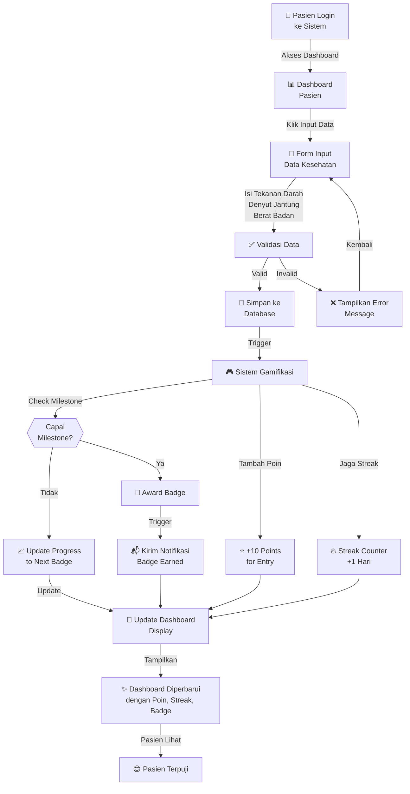
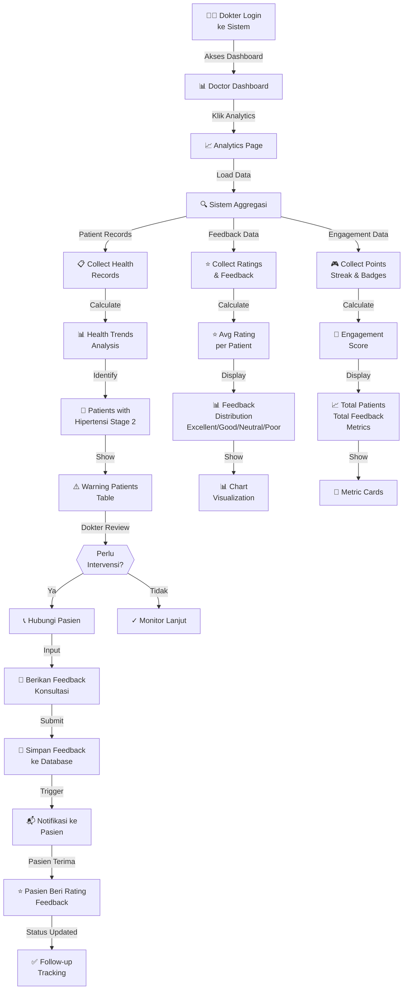
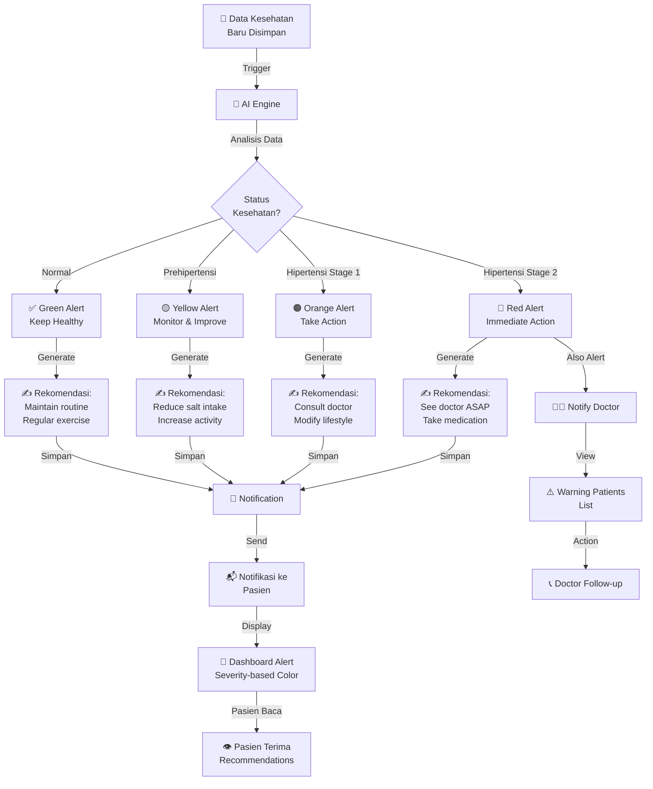
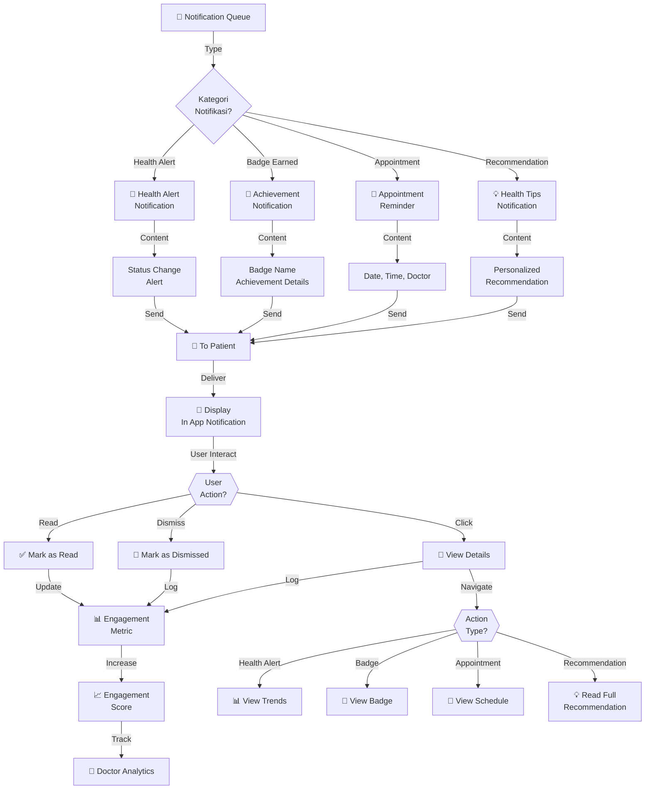
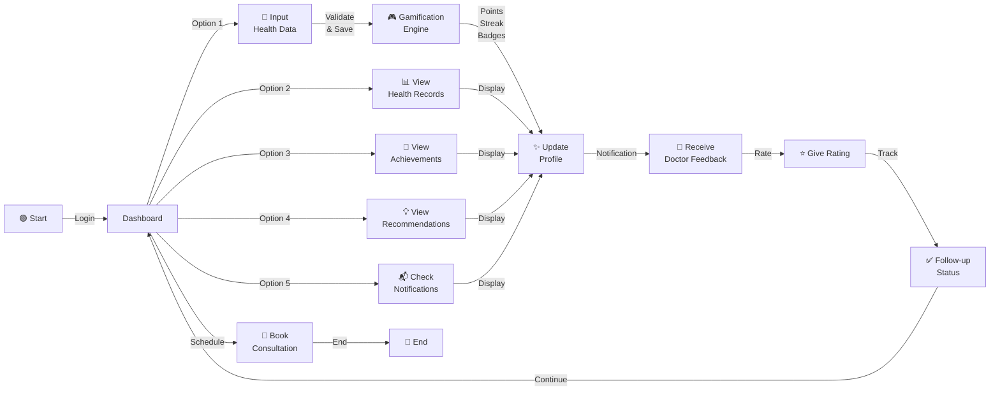
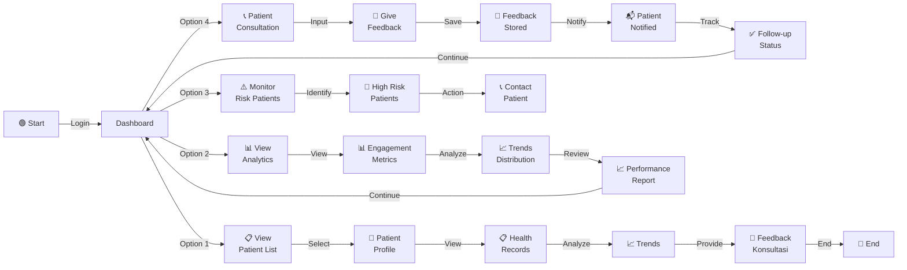

# Activity Diagram
## Telehealth Application Workflows

## 1. Patient Input & Gamification Flow

## 2. Doctor Analytics & Follow-up Flow

## 3. Health Recommendations & Alert System

## 4. Notification & Engagement Cycle

## 5. Complete User Journey - Patient

## 6. Complete User Journey - Doctor

## Key Flows Summary

| Flow | Pemicu | Proses | Output |
|------|--------|--------|--------|
| **Input & Gamification** | Pasien input data | Validasi → Simpan → Hitung poin/streak → Award badge | Dashboard update, Notifikasi |
| **Doctor Analytics** | Dokter akses analytics | Agregasi data → Hitung metrik → Identifikasi risiko | Dashboard metrics, Warning list |
| **Health Recommendations** | Data kesehatan baru | Analisis AI → Generate rekomendasi → Alert berdasar status | Notifikasi + Rekomendasi |
| **Feedback & Follow-up** | Dokter beri feedback | Simpan → Notifikasi → Pasien rating → Track status | Follow-up tracking |
| **Engagement Cycle** | Notifikasi terkirim | User interaksi → Track engagement → Update score | Meningkatkan engagement |
