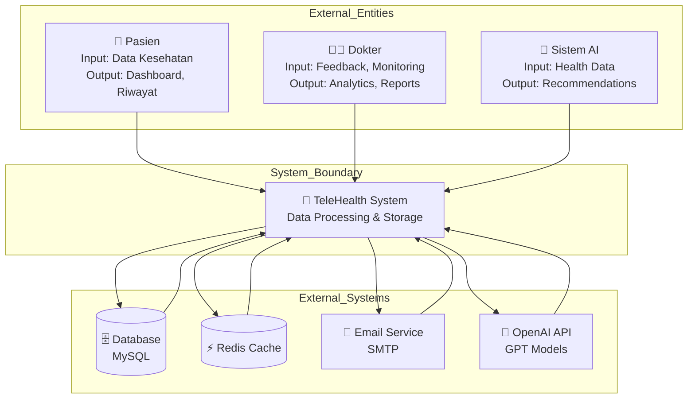
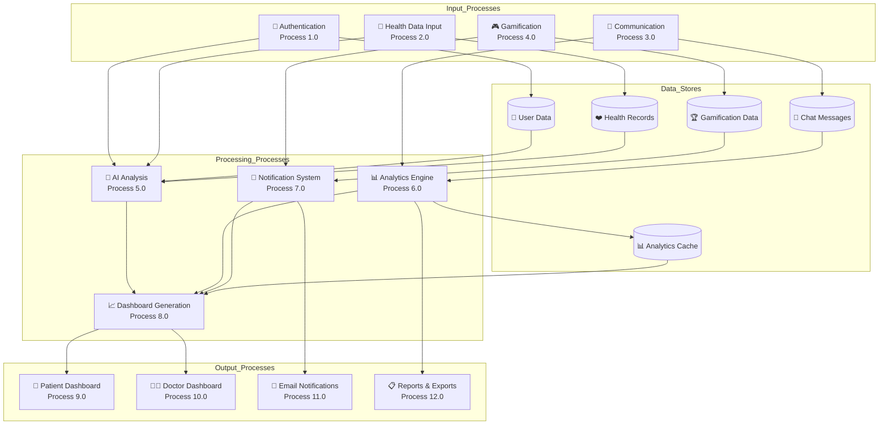
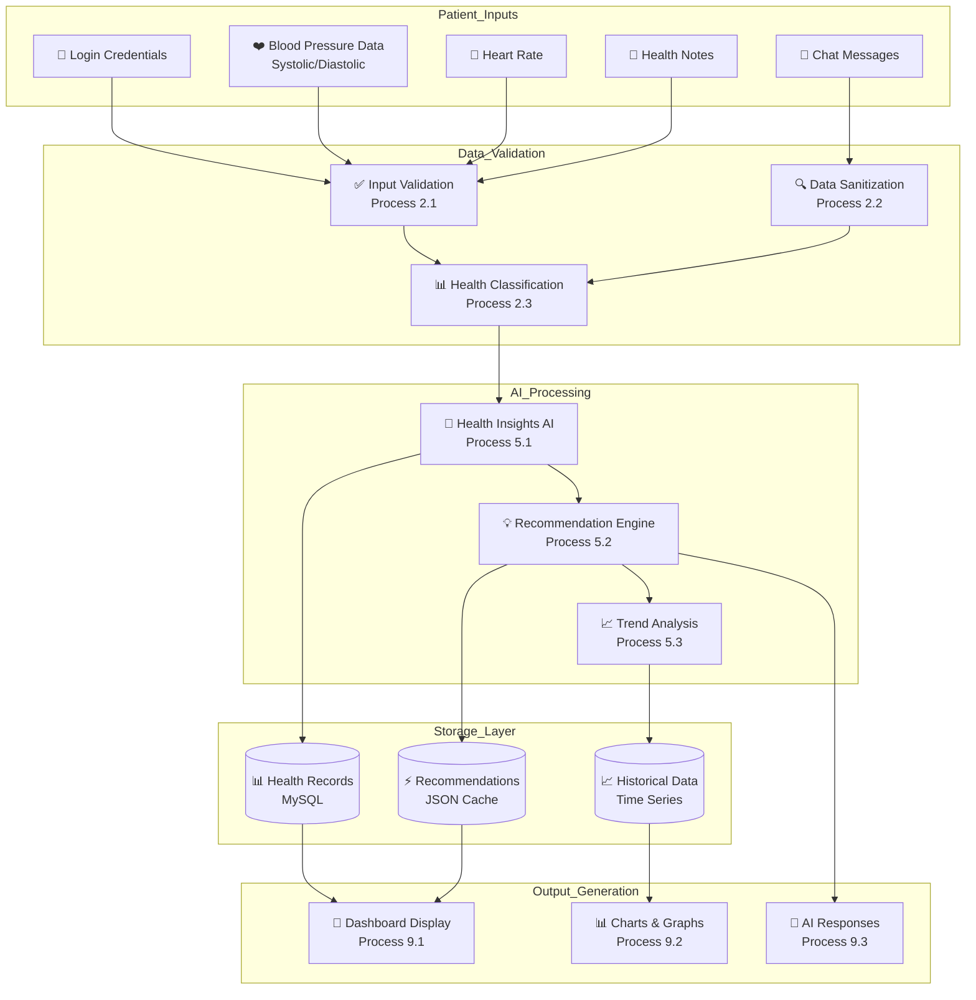
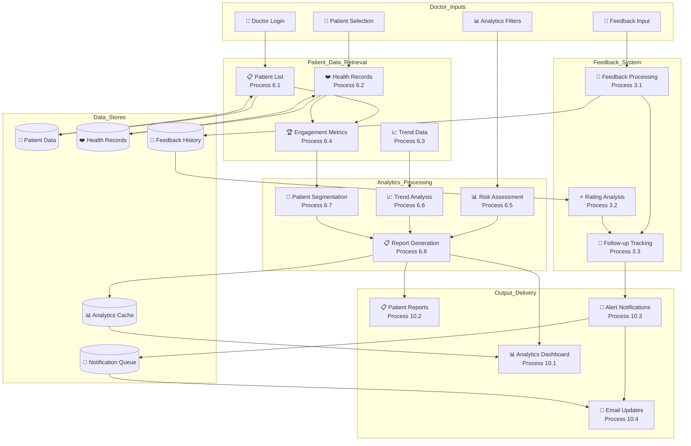
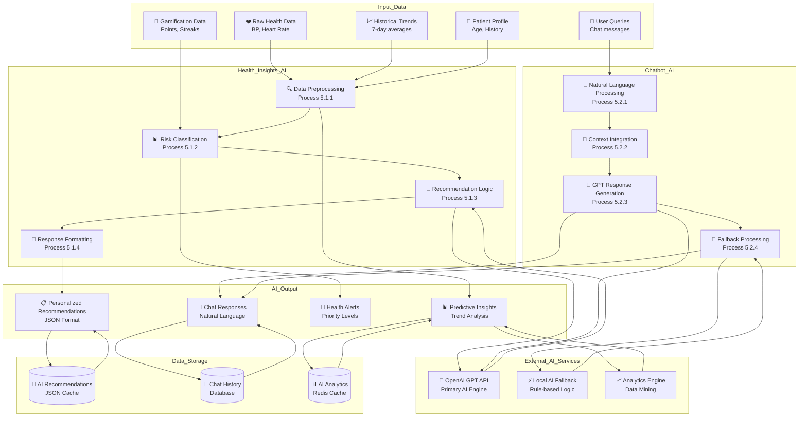
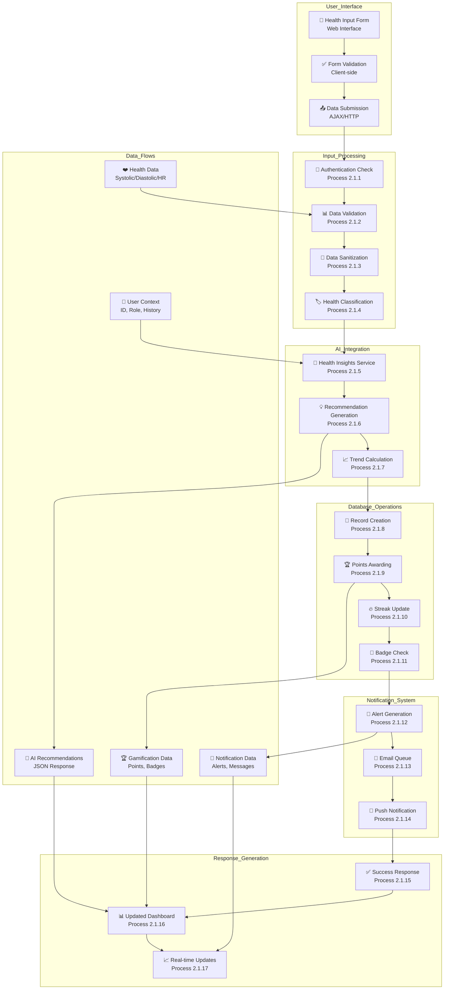
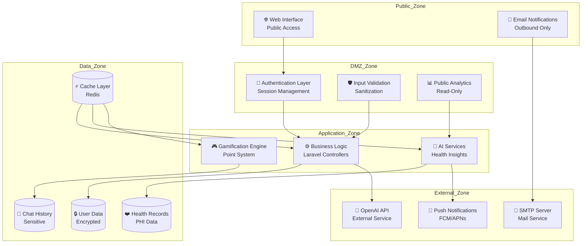

# 📊 Data Flow Diagram (DFD) - Sistem TeleHealth

## Level 0 DFD: Context Diagram

## Level 1 DFD: Main System Processes

## Level 2 DFD: Patient Health Data Flow

## Level 2 DFD: Doctor Analytics Flow

## Level 2 DFD: AI Module Data Flow

## Level 3 DFD: Health Data Input Process

## Data Dictionary

### Data Flows

| Data Flow | Description | Source | Destination | Format |
|-----------|-------------|--------|-------------|--------|
| **DF1 - Health Data** | Raw blood pressure, heart rate, notes | Patient Input Form | Validation Process | JSON |
| **DF2 - User Context** | User ID, role, medical history | Authentication | AI Processing | Object |
| **DF3 - AI Recommendations** | Personalized health advice | AI Engine | Database/Response | JSON |
| **DF4 - Gamification Data** | Points, streaks, badges earned | Gamification Engine | User Dashboard | JSON |
| **DF5 - Notifications** | Alerts, reminders, updates | Notification System | Email/Push Service | JSON |

### Data Stores

| Data Store | Description | Structure | Access |
|------------|-------------|-----------|--------|
| **DS1 - User Data** | User profiles, credentials, roles | MySQL Table | CRUD |
| **DS2 - Health Records** | BP readings, vitals, timestamps | MySQL Table | Create/Read |
| **DS3 - Chat Messages** | AI conversations, history | MySQL Table | Create/Read |
| **DS4 - Gamification** | Points, badges, achievements | MySQL/Redis | Read/Update |
| **DS5 - Analytics Cache** | Computed metrics, reports | Redis Cache | Read/Write |

### Processes

| Process ID | Name | Description | Input | Output |
|------------|------|-------------|-------|--------|
| **1.0** | Authentication | User login/validation | Credentials | Session Token |
| **2.0** | Health Data Input | Process health submissions | Health Data | Validated Records |
| **3.0** | Communication | Handle chat/feedback | Messages | Responses |
| **4.0** | Gamification | Award points/badges | User Actions | Achievements |
| **5.0** | AI Analysis | Generate insights | Health Data | Recommendations |
| **6.0** | Analytics | Process metrics | Raw Data | Reports |
| **7.0** | Notifications | Send alerts | Events | Messages |
| **8.0** | Dashboard Gen | Create UI data | Processed Data | Display Data |

### External Entities

| Entity | Description | Data Input | Data Output |
|--------|-------------|------------|-------------|
| **Patient** | End user monitoring health | Health data, queries | Dashboard, reports |
| **Doctor** | Healthcare provider | Feedback, monitoring | Analytics, alerts |
| **AI System** | OpenAI GPT service | Health context | Recommendations |
| **Email Service** | SMTP notification service | Alert data | Sent emails |

## Trust Boundaries & Security

## Data Flow Summary

### Primary Data Flows:
1. **Patient → System**: Health data input and queries
2. **System → AI**: Health data for analysis and recommendations
3. **AI → System**: Personalized insights and responses
4. **System → Doctor**: Analytics and patient monitoring data
5. **System → Patient**: Dashboard updates and notifications
6. **System → External**: Email alerts and push notifications

### Critical Data Paths:
- **Health Data Pipeline**: Input → Validation → AI → Storage → Display
- **Communication Pipeline**: Message → AI → Response → Storage
- **Gamification Pipeline**: Action → Points → Badges → Notifications
- **Analytics Pipeline**: Raw Data → Processing → Cache → Dashboard

This DFD provides a comprehensive view of how data flows through the TeleHealth system, highlighting the AI integration and multi-user interactions.
