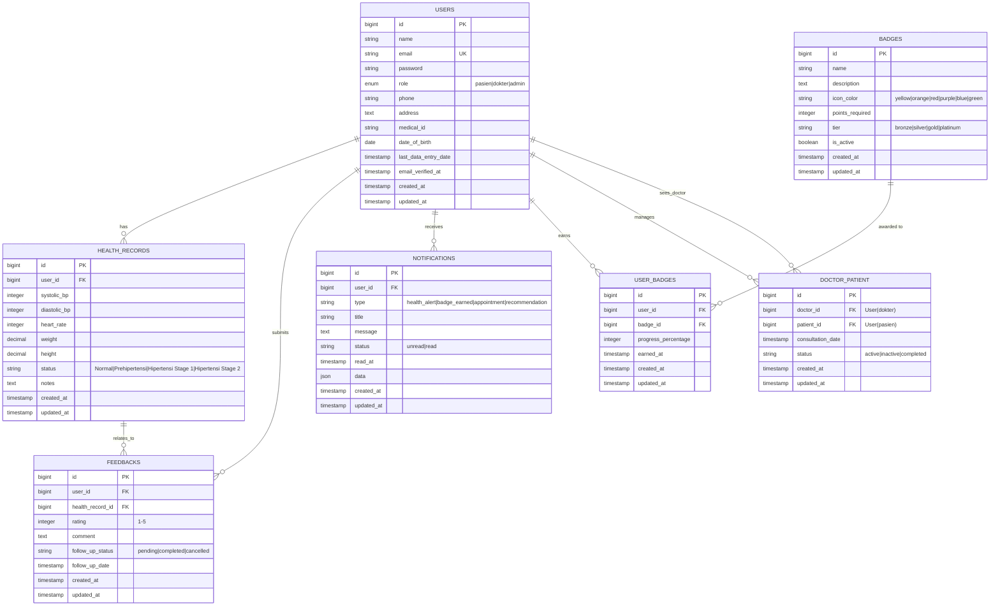

# Entity Relationship Diagram (ERD)
## Telehealth Application Database Schema

## Relasi Detail

### 1. **Users** (Pengguna Sistem)
- Central entity dengan role: pasien, dokter, atau admin
- One doctor dapat have banyak patients
- One patient dapat have satu atau lebih doctors

### 2. **Health Records** (Catatan Kesehatan)
- Milik seorang pasien
- Menyimpan data tekanan darah, detak jantung, berat badan
- Menghasilkan status kesehatan otomatis
- Berkaitan dengan feedback dari dokter

### 3. **Feedbacks** (Umpan Balik/Konsultasi)
- Dokter memberikan feedback terhadap health record pasien
- Memiliki follow-up tracking
- Rating system untuk kepuasan pasien

### 4. **Notifications** (Notifikasi)
- Sistem otomatis untuk alert kesehatan
- Badge achievement notifications
- Appointment reminders
- Personalized health recommendations

### 5. **Badges & User Badges** (Gamifikasi)
- Badge adalah penghargaan yang dapat dicapai
- User_badges mencatat progress dan saat earning
- Multiple tiers untuk motivasi berkelanjutan

### 6. **Doctor Patient** (Hubungan Dokter-Pasien)
- Junction table untuk many-to-many relationship
- Melacak konsultasi dan status hubungan
